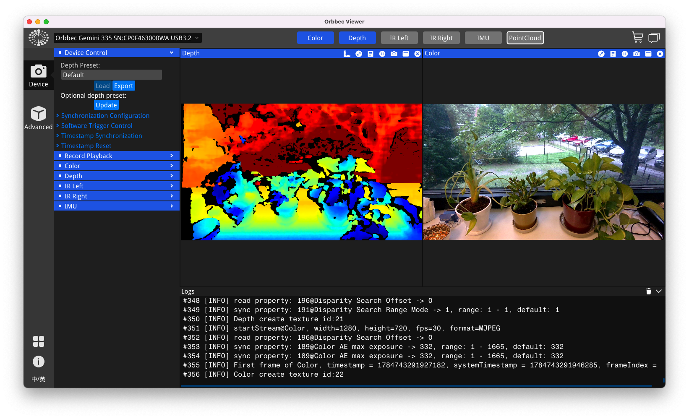
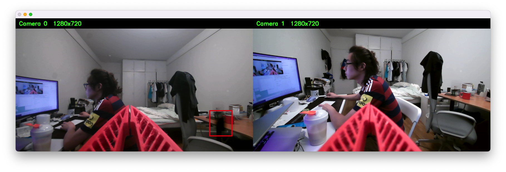

# 实验记录 04 · 相机连通与画面验收

- **日期**：2026-07-22
- **平台**：Mac（Apple Silicon）+ XLeRobot + Gemini 335 + 两只 InnoMaker 手腕 UVC 相机
- **状态**：✅ Gemini RGB / Depth 可视化正常；✅ 两只手腕相机可同时出流；⚠️ 白臂手腕相机有固定边缘黑斑。

## 1. 今日结果

### Gemini 335 头部深度相机

- 已通过 USB 3.2 连接并被官方 SDK 识别：`Orbbec Gemini 335`，PID `0x0800`，序列号 `CP0F463000WA`。
- 传感器：Color、Depth、Accel、Gyro、LeftIR、RightIR。
- 官方 Viewer 已确认 `Color 1280×720 @ 30 FPS` 与 Depth 伪彩画面均正常。
- macOS 上 Orbbec SDK 使用 libuvc 打开视频接口时需要 `sudo`；这不是 Jetson/Linux 的最终部署流程。



### 两只手腕相机

- OpenCV 同时识别到两只手腕相机（当前 Mac 索引 `0`、`1`）和 Mac 内置相机（当前索引 `2`）。索引由拔插顺序决定，**不可作为永久身份**。
- 两只手腕相机可同时以 `1280×720` 出流；用遮镜头的方法标记左/右手。
- 白色机械臂上的相机有少量固定于画面边缘的模糊黑斑。已确认拔插、擦拭与移动相机后仍固定在同一像素位置，推定为内部镜头/传感器污点。可用于当前连通与安装测试，但不要用于正式训练数据；保留图片并考虑保修/更换。
- 手腕相机型号为 InnoMaker U20CAM-1080P 类 32×32 UVC 广角模组：无自动对焦；M12 镜头可在实时预览中小幅手动调焦。只在镜筒能轻松转动时操作，切勿强拧或拆镜头。



## 2. 本机软件位置

Orbbec 下载包按操作系统与 CPU 架构区分，不提交到 Git；每台开发机自行下载后解压到：

```text
external/orbbec/OrbbecSDK_<version>_macOS/
external/orbbec/OrbbecViewer_<version>_macOS_arm64/
```

本机已验证的版本：Orbbec SDK / Viewer `v2.9.3`。官方下载：[OrbbecSDK v2.9.3 Release](https://github.com/orbbec/OrbbecSDK_v2/releases/tag/v2.9.3)。若 macOS 提示下载隔离，可在**确认来自官方 release 后**运行：

```bash
xattr -dr com.apple.quarantine external/orbbec/OrbbecSDK_*_macOS external/orbbec/OrbbecViewer_*_macOS_arm64
```

## 3. 日常检查命令

在仓库根目录执行：

```bash
# 1) 深度相机是否在线：列出 Gemini 与 Color / Depth / IMU / IR 传感器
./tools/check_orbbec.sh

# 2) 启动官方可视化：先开 Color 与 Depth；不要点 firmware / flash / Update
./tools/launch_orbbec_viewer.sh

# 等价的原始命令（调试时使用；注意 SDK/Viewer 已从仓库根目录移至 external/orbbec/）
cd external/orbbec/OrbbecViewer_v2.9.3_202607161423_b7e38ef_macOS_arm64
sudo ./OrbbecViewer
cd ../../..

# 3) 枚举手腕相机、保存每路静态测试图到 outputs/captured_images/
conda activate lerobot
lerobot-find-cameras opencv --record-time-s 2

# 4) 双路手腕相机实时预览（q 或 Esc 退出）
python tools/preview_cameras.py 0 1 --width 1280 --height 720 --fps 30
```

macOS 首次运行 OpenCV 时，要在「系统设置 → 隐私与安全性 → 相机」允许终端 App。第 3 步得到的索引需以画面实际身份为准；第 4 步中遮住镜头即可确认左/右手。若出现模糊，先检查镜头保护膜、污渍与照明；该 UVC 模组依赖手动而非自动对焦。

> 2026-07-23 更新：同时接入头部 Gemini 的 RGB 后，本机当前识别为 `0` 白臂手腕、`1` 黑臂手腕、`2` 头部相机。该编号仍会随 USB 拔插改变；LLM 实验临时使用 `2`，Jetson 部署前必须改为 udev 固定名。

## 4. Jetson 接线计划

需要连接 5 个 USB 外设：Gemini、两只手腕相机、白臂控制板、黑臂控制板；Jetson 有 4 个主机口。建议：

```text
Jetson USB 1 ─ Gemini 335（USB 3.x，直连）
Jetson USB 2 ─ 左手腕 UVC 相机（直连）
Jetson USB 3 ─ 右手腕 UVC 相机（直连）
Jetson USB 4 ─ 带独立供电的 USB 3.x / 5 Gbps Hub
                 ├─ 白臂控制板（串口数据）
                 └─ 黑臂控制板（串口数据）
```

不要用 USB 2.0 或无外接供电的小 Hub 承载多路相机。Gemini 应优先直连；两块控制板数据量小，适合放在有独立供电的 Hub 上。
